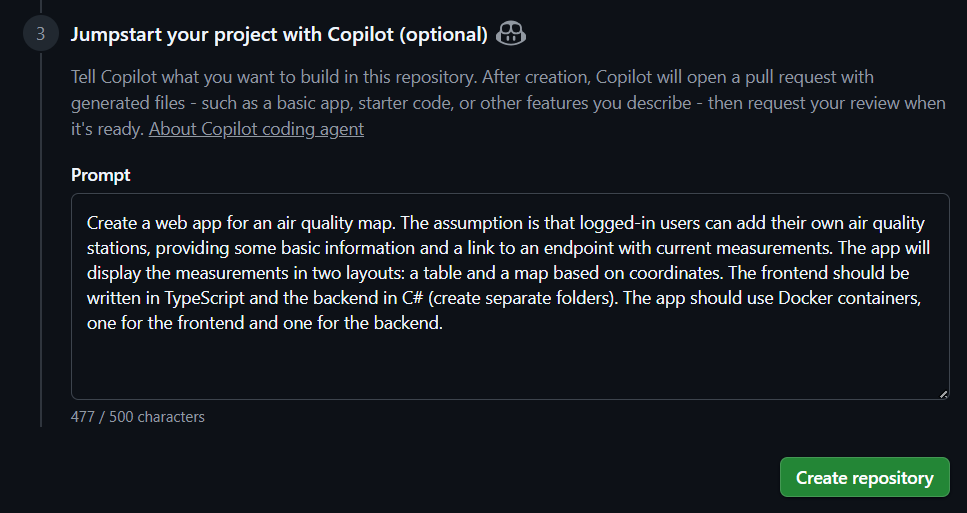

# GitHub Copilot Course - Practical Task: Documentation of prompts and workflow

## Overview of the app

A full-stack web application for managing and visualizing air quality monitoring stations. Users can register, add their own air quality stations with coordinates and measurement endpoints, and view all stations in both table and map layouts. For a full and detailed description, see the [README.md](../README.md) file.


Almost all code  (about 95%) was generated with GitHub Copilot, using various models and tools. Project is published in the repository [air-quality-map](https://github.com/IrekGodelTech/air-quality-map). With [commits history](https://github.com/IrekGodelTech/air-quality-map/commits/main/) you can check the development progress. Commits correspond to tasks and prompts. In the [actions section](https://github.com/IrekGodelTech/air-quality-map/actions) you can find CI/CD workflows that build and test the app (pipelines was generated with Copilot).


## Prompt history (key steps)

I have selected a few prompts that I consider as important or interesting.

### Initial prompt
The initial prompt was written during the creation of a repository and looked like this:

It took about 20 minutes for Copilot to generate the initial codebase with basic functionality (backend and frontend folders, Docker files, user registration and login, adding stations, displaying stations in table and map layouts). He generated 47 source files in total. The first commit with the initial code is available [here](https://github.com/IrekGodelTech/air-quality-map/commit/8fe1fd5ec4495938ae7b61956adfa95ec1534875). He also created a pull request for the initial code. In PR conversation he described of what he has done and added screenshots of the app running locally (can be found [here](https://github.com/IrekGodelTech/air-quality-map/pull/1)).
After that, I used a few more specific prompts to make some changes, e.g. replace SQLite with PostgreSQL and then merged the PR.

### Generating Copilot instructions file
For providing context to Copilot (project description and structure, existing code and build commands) once for each prompt, I asked him to generate a `copilot-instructions.md` file for the repository, based on instructions from [GitHub Docs](https://docs.github.com/en/copilot/how-tos/configure-custom-instructions/add-repository-instructions#asking-copilot-coding-agent-to-generate-a-copilot-instructionsmd-file) (here you can find the prompt that I copied). You can find commit with the generated file [here](https://github.com/IrekGodelTech/air-quality-map/commit/268df3148ba3c3fb268eabaf5d3e78c8b41b3e6c).

### Add new feature for backend
Prompt:
```
Add background job, that will periodically fetch data from all stations (with endpoint field) and save them in the database. Period should be configurable from #file:appsettings.json. Here you have structure of the response from endpoint:
{
    "created_at": "2025-12-18T09:23:44Z",
    "entry_id": 5612,
    "field1": "45",
    "field2": "63",
    "field3": "74",
    "field4": "1.3",
    ... other fields ...
}
Here is the matching between response and #file:Measurement.cs:
created_at -> CreatedAt
entry_id -> Id
field2 -> PM25
field3 -> PM10
field4 -> Temperature
Before adding entry to DB, get the newest one from DB and check whether fetched one is newer (compare created_at)
```

Copilot added field for period to `appsettings.json`, created a new service for fetching data from endpoints, registered it in DI container, and created a hosted background service that runs periodically and calls the fetching service. He also checked whether backend builds after the changes. I didn't like some of the dependencies, so I asked him to refactor the code in the `ExternalMeasurementService.cs` file using the following prompt:
```
This service should not depend on dbContext. Replace it with proper #file:MeasurementService.cs 
```
He rewrote the service to use the `MeasurementService.cs` for adding measurements to the database instead of using `dbContext` directly. The final commit with the new feature is available [here](https://github.com/IrekGodelTech/air-quality-map/commit/102d2e7ce2599b028c508b2f12331f12646e129a).

### Add new feature for frontend
Prompt:
```
Add chart view for measurement details. It should be available for PM2.5, PM10 and Temperature values. It should be displayed in new window after clicking a button "View chart" near the field name.
```
Copilot created a new components: `MeasurementChartModal.tsx` and `MeasurementDetailesView.tsx`. In addition, he added new tests for these components and ran them to check if they would pass. Some of them failed, so Copilot fixed the problems in the tests in one go. After that, I noticed that the generated code caused some ESLint errors, so I asked him to fix them with the following prompt:
```
`npm run lint` finished with errors. Fix them.
```
Copilot found unused variable and fixed the linting error by removing it. The final commit with the new feature is available [here](https://github.com/IrekGodelTech/air-quality-map/commit/9c3ecd6f6b303acbfc1cc69b3195b770aba318e0).

### Fix failing frontend tests
Prompt:
```
Frontend tests pipeline failed. Fix errors
```
Copilot checked the pipeline logs (with MCP GitHub server). He generated fixes for the tests several times, until all tests passed. After each iteration he ran tests locally and checked the results.

### Refactor pipelines
Prompt:
```
Refactor pipeline structure (both frontend and backend). First, it should format code, then run tests and finally build application and docker image.
```
Copilot restructured both pipelines according to the prompt. He chose technologies for formatting and testing - `ESLint` and `Vitest` for frontend, and `dotnet format` and `xUnit` for backend. He created separate jobs for formatting, testing, building, and dockerizing the applications. I ran these pipelines and they passed despite the failure of the tasks. I wrote the following prompt to fix that:
```
Both frontend and backend pipelines completed successfully however there are annotiations with errors in both sides. Refactor pipelines so when there are errors in some step it should failed.
```
Copilot removed `continue-on-error: true` from all jobs and steps, so that any error would cause the pipeline to fail.
The final commit with the refactored pipelines is available [here](https://github.com/IrekGodelTech/air-quality-map/commit/5290a81fbfe62bffb187bbeef3210302da212de1).


## Tools/models/MCP used

Tools:
- GitHub Copilot in VS Code
- GitHub Actions for CI/CD
- `.github/copilot-instructions.md` generated with Copilot according to instructions from [GitHub Docs](https://docs.github.com/en/copilot/how-tos/configure-custom-instructions/add-repository-instructions#asking-copilot-coding-agent-to-generate-a-copilot-instructionsmd-file)
- agents and instructions for C# and React copied from the repository [github/awesome-copilot](https://github.com/github/awesome-copilot)

Models:
- Claude Haiku 4.5 (at the beginning)
- Claude Sonnet 4.5

MCP:
- github - used for access GitHub platform, escpecially for Actions module and CI/CD pipeline results
- context7 - used for access up-to-date, version-specific documentation during code generation


## Insights and recommendations for future use of Copilot

- initial prompt, that can generate sketch of the app structure and basic code, is very useful to start the project quickly
- using Copilot instructions and agents for specific languages (C#, React) makes the suggestions more relevant and accurate
- newer models provide better code but the differences are not very significant for small projects
- Copilot works much better for backend (C#) than for frontend (React/TypeScript), especially when it comes to fixing bugs
- generating tests is one of the strongest features of Copilot, it can create unit tests with good coverage
- one of the worst use cases is fixing bugs in frontend code (especially related to UI), Copilot often suggests incorrect fixes
- using Copilot for code refactoring and improvements is useful, but requires careful review of the suggestions
- CI/CD pipelines generated by Copilot work well, but may require some adjustments to handle errors properly